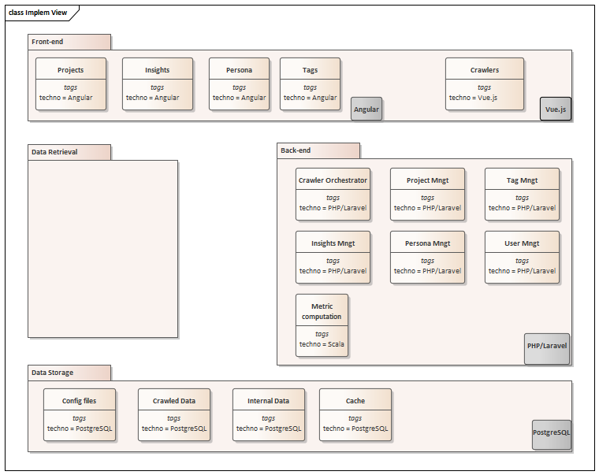

# Implementation View

Cette vue introduit les composants logiques, de haut niveau, de l'architecture de fa&#231;on statique et indépendamment de toutes implémentations techniques. Elle permet d'identifier les différents composants et mécanismes du système à réaliser et de définir pour chacun d’eux leur(s) r&#244;le(s) technologique(s)
