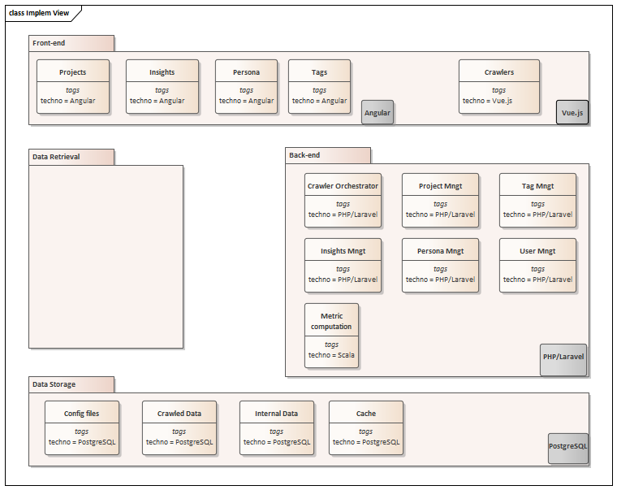

# Implementation View

Cette vue introduit les composants logiques, de haut niveau, de l'architecture de fa&#231;on statique et indépendamment de toutes implémentations techniques. Elle permet d'identifier les différents composants et mécanismes du système à réaliser et de définir pour chacun d’eux leur(s) rôle(s) technologique(s)

## Module Angular
Angular un framework pour clients, open source, basé sur TypeScript et codirigé par l'équipe du projet &#171; Angular &#187; chez Google ainsi que par une communauté de particuliers et de sociétés. Angular est une réécriture complète d'AngularJS, cadriciel construit par la même équipe. Il permet la création d’applications Web et plus particulièrement d'applications Web monopages : des applications Web accessibles via une page Web unique qui permet de fluidifier l’expérience utilisateur et d’éviter les chargements de pages à chaque nouvelle action. Le framework est basé sur une architecture du type MVC et permet donc de séparer les données, le visuel et les actions pour une meilleure gestion des responsabilités. Un type d’architecture qui a largement fait ses preuves et qui permet une forte maintenabilité et une amélioration du travail collaboratif.
https://angular.io

## Module PHP/Laravel
Laravel est un framework web open-source écrit en PHP1 respectant le principe modèle-vue-contrôleur et entièrement développé en programmation orientée objet. Laravel est distribué sous licence MIT, avec ses sources hébergées sur GitHub.
https://laravel.com

## Module PostgreSQL
PostgreSQL est un système de gestion de base de données relationnelle et objet (SGBDRO). C'est un outil libre disponible selon les termes d'une licence de type BSD.
https://www.postgresql.org/

## Module Vue.js
Vue.js (aussi appelé plus simplement Vue), est un framework JavaScript open-source utilisé pour construire des interfaces utilisateur et des applications web monopages.
https://vuejs.org
