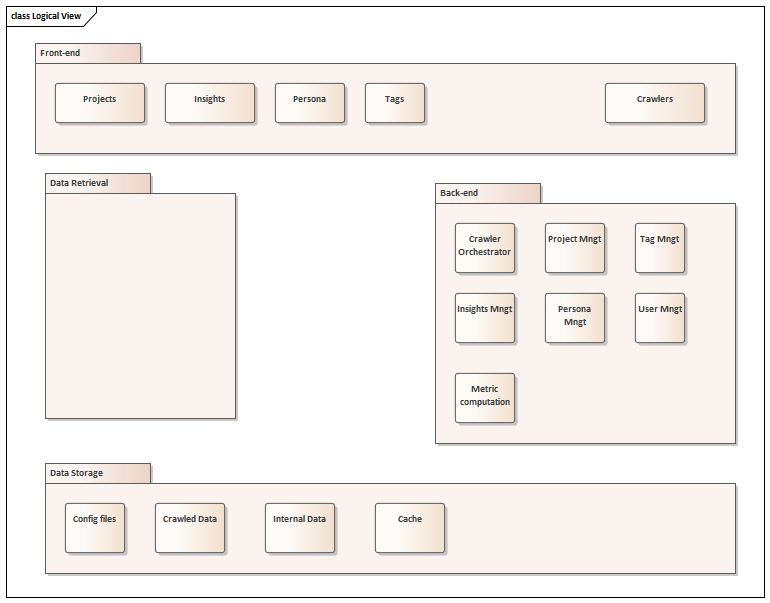

# Logical View

Cette vue introduit les composants logiques, de haut niveau, de l'architecture de fa&#231;on statique et indépendamment de toutes implémentations techniques. Elle permet d'identifier les différents composants et mécanismes du système à réaliser et de définir pour chacun d’eux leur(s) rôle(s) technologique(s)

## Front-end

### Module Crawlers
gère les crawlers  (démarrage/arrêt) et vide les files d'attente.

### Module Insights

### Module Persona

### Module Projects

### Module Tags

## Back-end

### Module Cache Mngt

### Module Crawler Orchestrator

### Module Insights Mngt
le composant qui crée les insights

### Module Metric computation
le composant qui traite les données crawlées en effectuant des calculs et des statistiques.

### Module Persona Mngt
 le composant qui crée un persona et permet à l'utilisateur de voir et de modifier des personas.

### Module Project Mngt
le composant qui crée les entreprises et les gère (ajout/suppression des membres, etc.).

### Module Tag Mngt
le composant qui crée les tags et les gère (ajout de critères / suppression de tag).

### Module User Mngt
le composant qui crée les utilisateurs et les gère (créer / supprimer / modifier).

## Data Retrieval

## Data Storage

### Module Cache
emplacement de stockage réservé qui collecte les données calculée

### Module Config files
les fichiers de configuration du système.

### Module Crawled Data
données stockées par les crawlers provenant de sources de données tierces.

### Module Internal Data
les données internes du système telles que les companies,les utilisateurs, les projets, etc.
