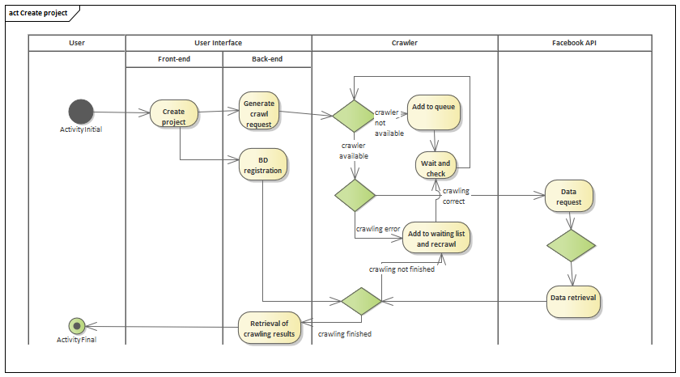
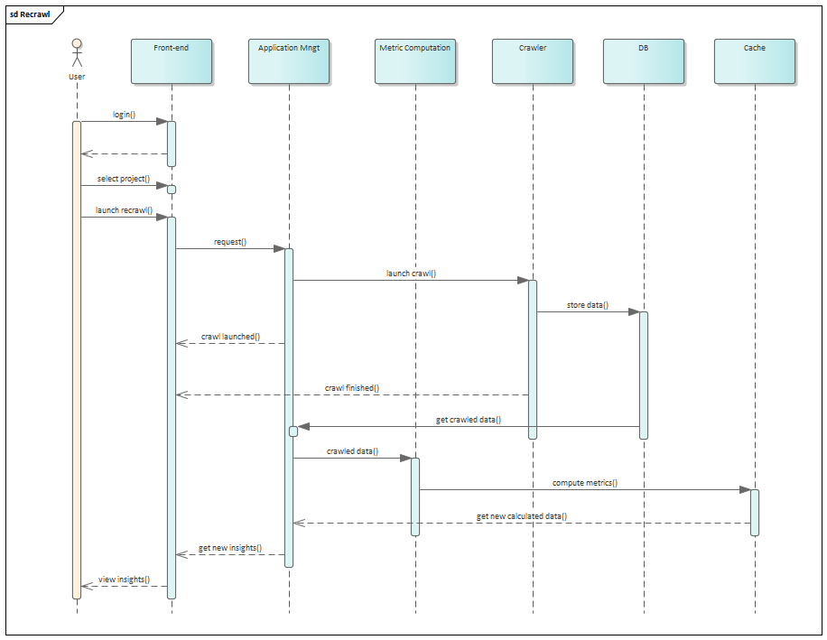

# Process View

Le premier processus décrit la création d'un projet et le lancement d'un crawl et continue jusqu'à obtenir les insights nécessaires.
Dans ce processus nous avons 4 acteurs principaux:

* L'utilisateur
* L'interface utlisateur qui représente l'application, séparé en back-end et front-end.
* Le crawler
* L'API Facebook qui est la source des données.

Dans le cadre de la vue de processus, le diagramme de séquence UML montre (en plus de ce que nous voyons dans les diagrammes précédents) certaines des réponses que l'utilisateur voit sur l'écran de l'interface utilisateur pendant qu'un processus est en cours d'exécution. Le processus en question est Le recrawl d'un projet ce qu'un utilisateur fait lorsqu'une mise à jour des informations est nécessaire, l'utilisateur lance donc un nouveau crawl pour obtenir plus de données et plus des insights.
Dans ce processus nous avons 7 acteurs principaux:

	* L'utilisateur.
	* L'interface utilisateur.
	* Metric Computation .
	* Application Management.
	* Le crawler
	* La base des données.
	* Le cache.

