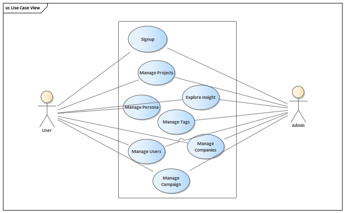

# Use Case View

Huit principaux cas d'utilisation sont actuellement mis en œuvre et seront donc examinés de plus près dans cette étude. Ils sont brièvement décrits ci-dessous.

## Actor Admin

## Actor User

## Boundary 

## UseCase Explore Insight
UC-3. Explore insights: L'utilisateur arrive sur l'ecran des résultats des recherches qui sont affichés visuellement.

* UC-3.1. Export data: L'utilisateur exporte les données dans un fichier Excel.

## UseCase Manage Campaign
UC-8. Manage campaigns

* l’utilisateur configure la campagne
* l'utilisateur exécute le “Targeting” pour publier les publicités facebook pour la population appropriée
* avoir les resultats sur facebook

## UseCase Manage Companies
UC-6. Manage companies

* UC-6.1. Add company: L'utilisateur crée une nouvelle entreprise.
* UC-6.2. Add company members: L'utilisateur ajoute des membres à son entreprise à partir d'utilisateurs existants ou crée de nouveaux utilisateurs et les ajoute en tant que membres.

## UseCase Manage Persona
UC-4.Manage persona

* UC-4.1. View persona: L'utilisateur choisit une persona et obtient les résultats visuellement.
* UC-4.2. Crawl sub-segments: L'utilisateur choisit un sous-segment et lance un crawl.

## UseCase Manage Projects
UC-2. Manage projects

* UC-2.1. Create new project: L'utilisateur remplit les informations nécessaires et lance le crawler.
* UC-2.2. Manage existing project: L'utilisateur gère un projet existant ( nouvelle crawl ou déplacement du projet vers un dossier par example).

## UseCase Manage Tags
UC-5. Manage tags

* UC-5.1. Select tags: L'utilisateur sélectionne les tags et obtient les critères visuellement.
* UC-5.2. Tag criteria: L'utilisateur sélectionne les tags et les critères à associer au tag.
* UC-5.3. Filter tags: L'utilisateur filtre les critères ou/et les tags et obtient les résultats visuellement.

## UseCase Manage Users
UC-7. Manage users

* UC-7.1. Manage account: L'utilisateur gère son profile.
* UC-7.2. Add new user: L'utilisateur crée un nouveau utilisateur.

## UseCase Signup
UC-1. Sign-up

* UC-1.1. Fill sign-up form: L'utilisateur arrive sur l'écran d’inscription et remplit le formulaire.
* UC-1.2. Facebook connection: L'utilisateur s'authentifie pour connecter son Facebook.
* UC-1.3. Manage facebook pages: L’utilisateur ajoute un ou plusieur pages facebook.

